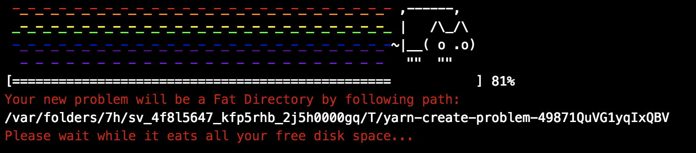

# 😈 create-problem 😈

[](https://www.npmjs.com/package/create-problem)
[](http://www.npmtrends.com/create-problem)

This package allows to YARN CREATE a PROBLEM for you. It creates temporary files filled with zeros in `temp` folder.



When script is killed it should free disk space back. But this is not a guaranteed behavior.

## Usage
```
yarn create problem
```

## License
MIT
